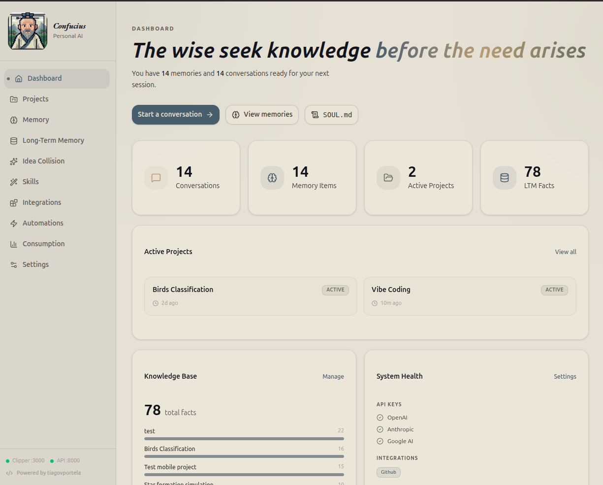
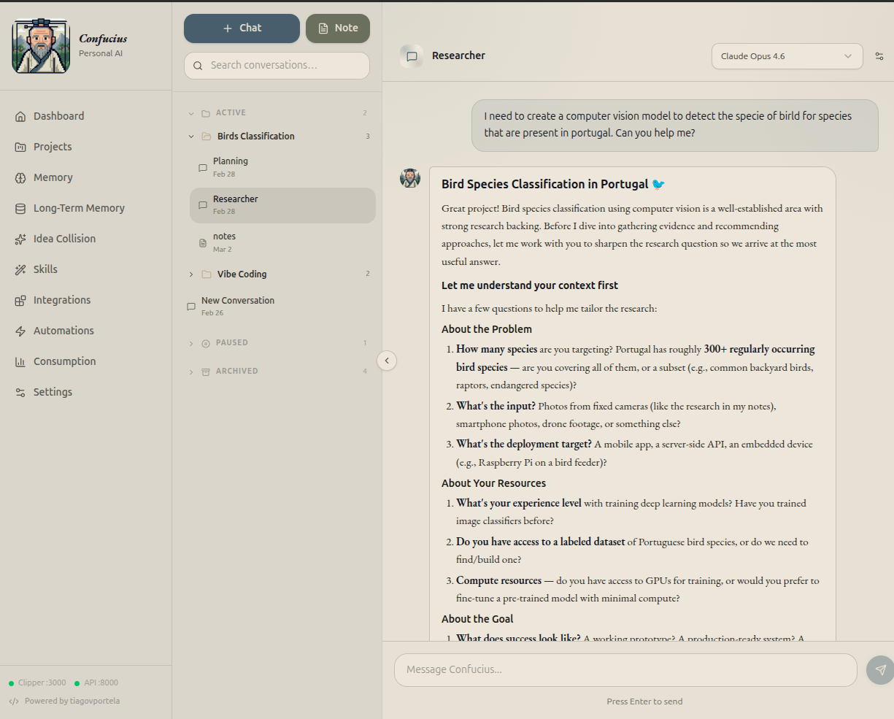
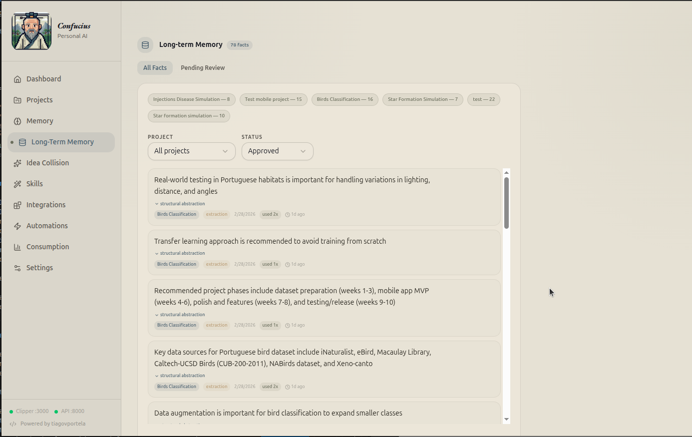
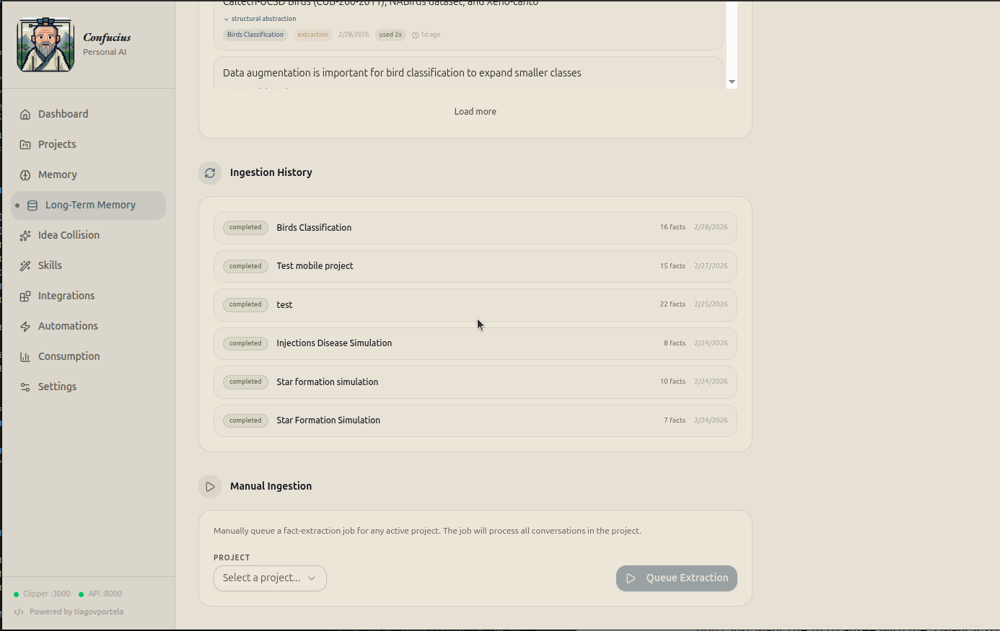
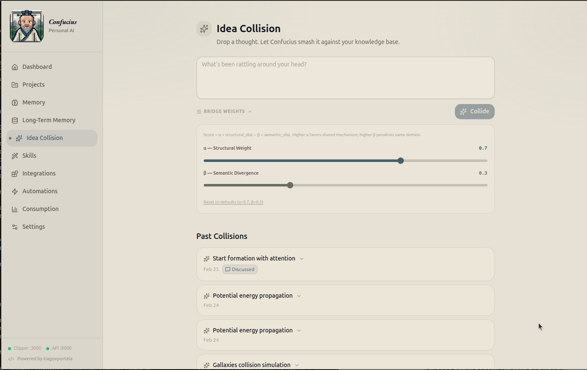
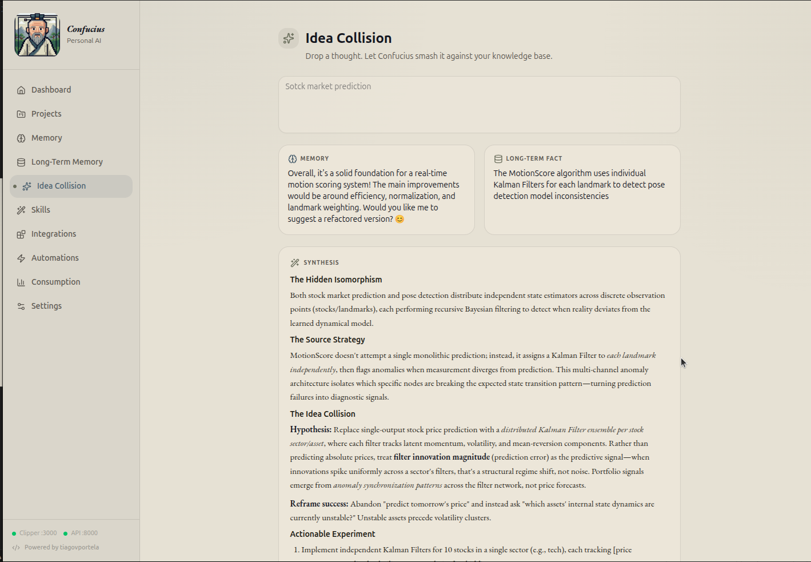
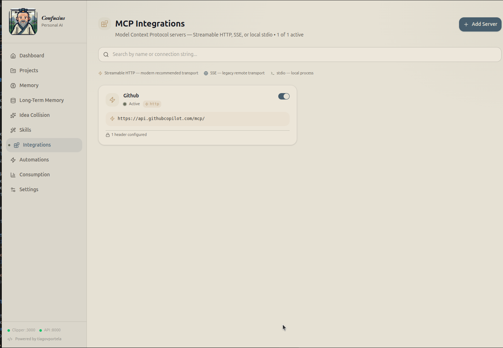
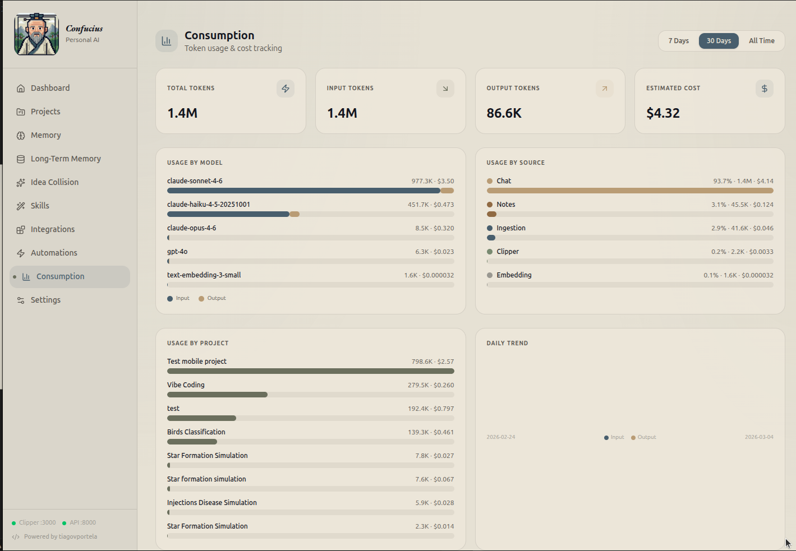
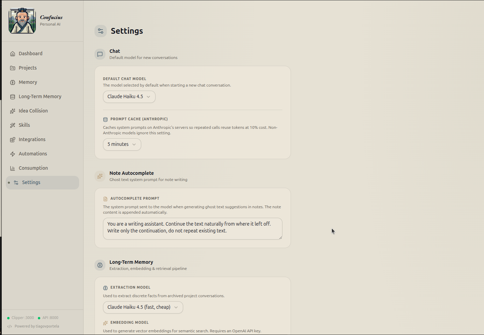

+++ 
draft = true
date = 2026-03-02T15:59:50Z
title = ""
description = ""
slug = ""
authors = []
tags = []
categories = []
externalLink = ""
series = []
+++

# Why I Built My Own "Second Brain" Just for the Fun of It

Let’s be honest: the world didn’t need another note-taking app. Between Notion, Obsidian, and the graveyard of productivity tools on my hard drive, I was "covered." But I had a problem.

For years, I bounced between every note-taking app on the market. But they all felt like digital filing cabinets, great for accumulating links, and "shower ideias", but terrible for actually *thinking*. I didn't want a place to just dump my ideias/research. I wanted a brainstorming partner. I wanted a tool that could help me explore ideas, design better systems, and connect dots I couldn't see.

So, instead of waiting for the perfect app to drop, I spent my weekends building a personal AI dashboard from scratch. 

So, I built Confucius. It’s a native desktop dashboard that doesn’t just "chat", it lives inside my projects. I built my own "Soul" in a machine, and to be honest building it was very fun!. Here is a look at what happens when you build a tool specifically for how your own brain works.

	
	

### Context shouldn't be a chore

Most AI tools treat every conversation like a first date. In Confucius, I have Memories (facts about me) and Skills (how I want things done).

If I’m in a coding project, the AI automatically knows I prefer Python type hints and modular architecture because those skills are pinned to the project. I don’t "harness" context; it’s just there.

  <iframe
    style="flex:1 1 320px; width:100%; aspect-ratio:16/9; border:0;"
    src="https://www.youtube.com/embed/akcJm2d9opY"
    title="Confucius app demo: memory and skills workflow"
    aria-label="Confucius app demo: memory and skills workflow"
    allowfullscreen>
  </iframe>
  <iframe
    style="flex:1 1 320px; width:100%; aspect-ratio:16/9; border:0;"
    src="https://www.youtube.com/embed/f-A6Wox352w"
    title="Confucius app demo: second workflow"
    aria-label="Confucius app demo: second workflow"
    allowfullscreen>
  </iframe>

### Gathering Dots (Without Losing My Mind)

Building side projects and falling down rabbit holes is messy. You spot a clever UI trick, read a deep-dive on a niche topic you're suddenly obsessed with, or uncover a weird bug fix you know you'll need later.

In the past, my solution was just dumping links into a Notion board. But that meant hoarding entire articles or massive documentation pages when I really only cared about one specific code block or a single paragraph. Months later, when I actually needed that insight, I’d have to sift through the entire link again just to find the tiny fragment I cared about.

To handle this, I built my own browser extensions for Chrome and Firefox. So when I find something fascinating, I just clip it. The app's server catches it and categorizes it as a "Memory" or a "Skill", it also  allows me to automatically summarizes it if i want. Later, when I start a new project, I just attach those specific memories/skills and the AI instantly adopts all that context without me having to type a massive prompt.

  <iframe
    width="100%"
    style="aspect-ratio:16/9; border:0;"
    src="https://www.youtube.com/embed/AAxJtDe7yD0"
    title="Confucius browser extension demo"
    allowfullscreen>
  </iframe>

### A Memory That Actually Lasts

Standard AI forgets everything the moment you clear the chat, I needed a tool that remembered my past explorations.
So i add to it a Long-Term Memory (RAG) pipeline that’s strictly mine. When I archive a project, the system extracts discrete facts and stores them in a local vector database.

Months later, when I ask a question in a new chat, the system does a quick "KNN search" and pulls in relevant facts from my past work. It’s a bridge between the "me" from six months ago and the "me" today.

	
	

### The Idea Collider Engine

This is the feature I am most proud of. Sometimes you don't need answers; you need a fresh perspective. I don't just want the AI to agree with me; I want it to challenge me. I built an algorithm based on Structure-Mapping Theory.

I give it a "shower thought," and the engine finds a memory that is semantically distant (a completely different topic) but structurally similar (the same underlying mechanism). [See this article to get more info about the algorithm]

It takes those three completely unrelated things, smashes them together, and forces the AI to synthesize a brand-new concept based on Structure-Mapping Theory.

The result? Novel insights that a standard chatbot would never find because it’s too busy being "helpful" and literal.  

	
	

### Playing by My Own Rules

Because this tool is just for me, I didn't have to compromise on the under-the-hood stuff:
* **True Integrations:** I wired up the Model Context Protocol (MCP). This lets the AI actually talk to my local tools and databases, like my GitHub repos, in real-time. 
* **Total Privacy:** When I'm working on something sensitive, I can route the chat through local, open-source models like Llama 3 via Ollama. 
* **No Hidden Prompts:** Every single system prompt—from the web clipper summarizer to the ghost text autocomplete, Structural Abstraction Prompt, Collision Synthesis Prompt and others, are fully exposed in the settings for me to tweak.
* **Counting Pennies:** API calls cost money. So, I built a consumption dashboard that tracks my token usage across chats, notes, and background jobs, estimating the exact cost per model. 

	
	

	
	

### The So What?

Building this wasn't about "disrupting the productivity space." It was about the sheer joy of crafting a tool that perfectly fits the weird, non-linear way I do things. It feels less like a piece of software and more like a digital extension of my own curiosity. 
