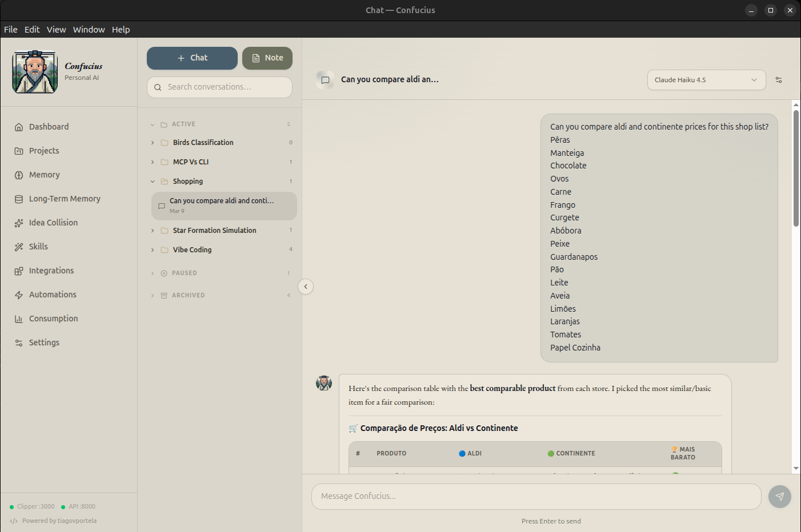
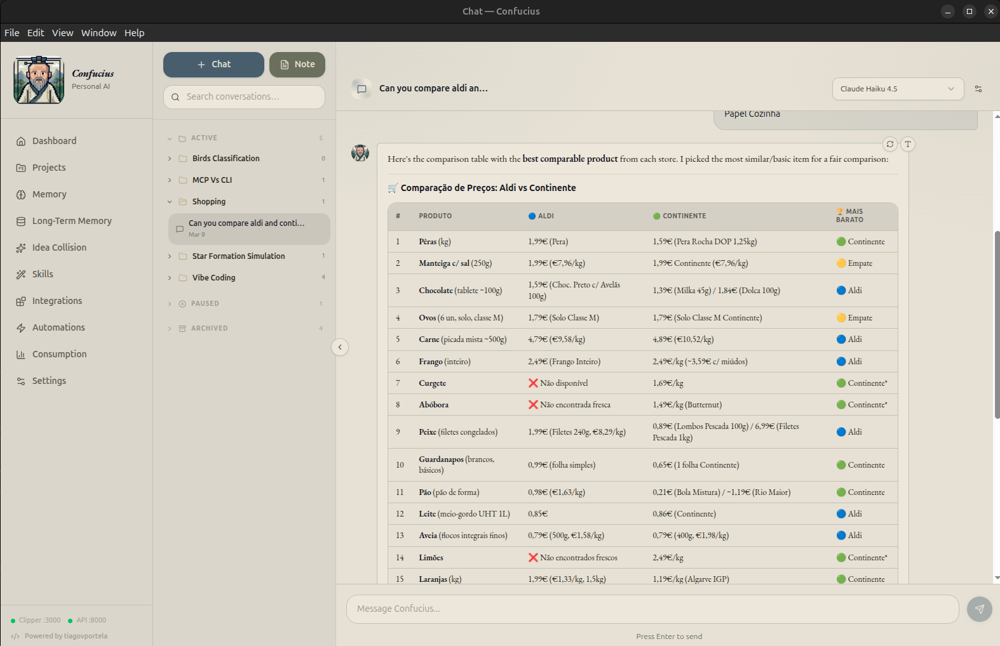
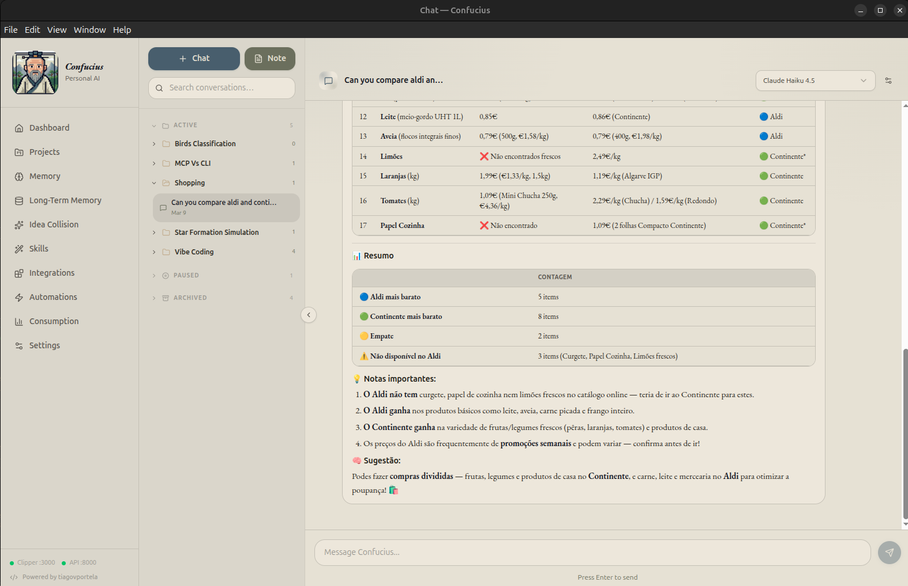

+++ 
draft = false
date = 2026-01-19T16:23:47Z
title = "Teaching My AI Assistant to Go Grocery Shopping"
description = "Building an MCP server that lets an AI assistant search and compare prices across Portuguese supermarkets in real time."
slug = "supermarket-mcp-server"
authors = ["Tiago Portela"]
tags = ["ai", "mcp", "python", "scraping", "side-project"]
categories = ["projects", "engineering"]
externalLink = ""
series = []
+++

# Teaching My AI Assistant to Go Grocery Shopping

Let me set the scene. It is a Sunday afternoon, I am sitting on the couch trying to plan the weekly grocery run, and I have three browser tabs open: Continente, Aldi, and Pingo Doce. I am doing what every price-conscious Portuguese person does — comparing the price of bananas across three different supermarkets. Tab-switching, squinting at unit prices, trying to remember if "per unit" means per kilogram or per piece. It is tedious. It is boring. And I am an engineer. So naturally, instead of spending 15 minutes comparing prices, I spent my weekends building a system that does it for me.

The result is **Supermarket MCP Server** — a tool that lets AI assistants search for products and compare prices across Portuguese supermarkets in real time. No browser tabs. No mental arithmetic. Just ask.

## The Idea: What If My AI Could Read Supermarket Websites?

If you read my previous post, you know I built [Confucius](https://tiagoportela.com/blog/confucius/) — a personal AI dashboard that lives inside my projects. One of its key features is MCP (Model Context Protocol) integration, which lets the AI actually talk to external tools and data sources in real time. Think of it as giving the AI hands. Instead of just answering questions from its training data, an MCP server allows the AI to actually reach out and do things — query databases, call APIs, scrape websites.

I looked at this and thought: what if I gave Confucius the ability to search supermarket catalogues? Not a static database of prices that goes stale in a day, but a live connection to the actual store websites. The AI could search, compare, and recommend — all in real time.

## The Architecture: One Interface, Multiple Scrapers

The core challenge is that every supermarket website works differently. Continente renders server-side HTML with product tiles you can parse. Aldi, on the other hand, uses Algolia as their search backend — meaning there is a clean JSON API hiding behind the storefront if you know where to look.

I needed a design that could handle both approaches without the MCP server caring about the difference. The solution is a classic abstraction layer:

```python
class BaseApi:
    def get_products_by_name(self, query: str) -> list[Product]:
        raise NotImplementedError

    def get_products_by_brand(self, brand: str, query: str) -> list[Product]:
        raise NotImplementedError
```

Every supermarket implements this interface. A simple registry maps store names to their implementations:

```python
_apis = {
    "continente": ContinenteApi(),
    "aldi": AldiApi(),
}

def get_api(name: str):
    if name not in _apis:
        raise ValueError(f"Unknown service: {name}. Available: {', '.join(_apis)}")
    return _apis[name]
```

Adding a new supermarket is just a matter of writing a new class that implements the same interface and registering it. The MCP server never needs to change.

## Two Supermarkets, Two Completely Different Strategies

This was the most interesting part of the build. The same problem — "find products matching a search query" — required completely different engineering approaches depending on the supermarket.

### Continente: Old-School HTML Scraping

Continente renders its search results as server-side HTML. To extract products, I send a GET request to their search endpoint and parse the response with BeautifulSoup:

```python
class ContinenteApi(BaseApi):
    BASE_URL = "https://www.continente.pt/pesquisa/"
    PAGE_SIZE = 35

    def _fetch_page(self, params: dict, start: int) -> BeautifulSoup:
        full_params = {**params, "start": start, "sz": self.PAGE_SIZE}
        response = requests.get(self.BASE_URL, params=full_params)
        response.raise_for_status()
        return BeautifulSoup(response.text, "html.parser")
```

The product data lives in `div` elements with specific CSS classes — `productTile` for each product card, `pwc-tile--price-primary` for the price, and so on. It is fragile by nature (if they redesign the page, the selectors break), but it works well and handles pagination.

One thing I had to handle carefully is malformed tiles. Sometimes the HTML is incomplete — a product card missing a price field or a broken link. Rather than crashing the whole search, I skip those tiles and log a warning:

```python
except (AttributeError, TypeError, KeyError):
    skipped += 1
    continue
```

### Aldi: Reverse-Engineering the Algolia API

Aldi was a different story. When I inspected their website's network requests, I discovered they use Algolia — a search-as-a-service platform — as their backend. This means that instead of parsing HTML, I can talk directly to their search API and get clean, structured JSON back.

```python
class AldiApi(BaseApi):
    def _fetch_products(self, params: dict) -> list[Product]:
        url = f"https://{self.ALGOLIA_APP_ID.lower()}-dsn.algolia.net/1/indexes/*/queries"
        payload = json.dumps({
            "requests": [
                {"indexName": "prod_pt_pt_offers", "query": params.get("query"), "hitsPerPage": 20},
                {"indexName": "prod_pt_pt_assortment", "query": params.get("query"), "hitsPerPage": 20},
            ]
        })
        r = requests.post(url, data=payload, headers=self.HEADERS)
        r.raise_for_status()
        results = r.json()["results"]
        return [self._parse_product(p) for h in results for p in h.get("hits", [])]
```

The Algolia API is publicly accessible (the credentials are embedded in their frontend JavaScript — this is standard for Algolia client-side integrations). The response includes structured fields like `productName`, `salesPrice`, and `brandName`, which makes parsing trivial compared to scraping HTML.

An interesting detail: Aldi uses two separate Algolia indices — `offers` for weekly promotions and `assortment` for their regular catalogue. I query both and merge the results, so the user always sees the full picture.

## The MCP Layer: Giving the AI Superpowers

With the scraping infrastructure in place, the MCP layer is clean. I expose two tools and three prompt templates:

```python
@mcp.tool()
def search_products(query: str, store: Literal["continente", "aldi"] = "continente") -> str:
    """Search for products by name in a Portuguese supermarket."""
    api = get_api(store)
    products = api.get_products_by_name(query)
    lines = []
    for p in products:
        lines.append(f"- {p.name}: {p.price} ({p.unit_price}) - {p.url}")
    return "\n".join(lines)
```

But the tools alone are just the low-level building blocks. The real power comes from the **prompt templates** — higher-level instructions that teach the AI how to orchestrate the tools for common tasks:

- **`compare_prices`** — searches for a product across all stores and recommends the best value
- **`build_shopping_list`** — takes a list of items, finds each one in every store, and tells you where to buy each item to minimise total cost
- **`find_brand_alternatives`** — compares a branded product with cheaper alternatives in the same store

These prompts are essentially recipes. They tell the AI: "here is a task, here are the tools you have, go figure it out." The AI handles the rest — making multiple tool calls, comparing results, reasoning about unit prices versus total prices, and presenting a coherent recommendation.

## What It Looks Like in Practice

Once the server is running, I connect it to Confucius via its MCP integration and have conversations like:

> "Compare the price of olive oil between Continente and Aldi."

The AI calls `search_products` twice (once per store), gets back real-time results with prices and unit prices, and gives me a side-by-side comparison with a recommendation.

Or something more ambitious:

> "I need to buy milk, eggs, rice, and chicken breast. Where should I shop?"

It searches for all four items across both supermarkets and builds an optimised shopping plan — maybe milk and rice from Aldi, eggs and chicken from Continente.

The AI is doing the boring tab-switching work that I used to do manually. And because it has access to unit prices, it catches things I might miss — like a larger pack being cheaper per kilogram even though the sticker price is higher.

<div style="display:flex; gap:1rem; flex-wrap:wrap;">
    
    
</div>
<div style="display:flex; gap:1rem; flex-wrap:wrap;">
    
</div>


## The Stack

The whole thing is deliberately simple:

- **Python 3.12** with type hints
- **FastMCP** for the MCP server (runs over HTTP on `localhost:8080`)
- **BeautifulSoup** for HTML parsing (Continente)
- **Requests** for HTTP calls
- **Algolia's public API** for Aldi
- **pytest** with mocking for tests
- **uv** as the package manager

No database. No caching layer. No frontend. Just a server that responds to MCP protocol requests. Every search hits the live supermarket data, so the results are always fresh.

## What I Learned

Building this was a useful exercise in a few things:

**Websites are not APIs, but sometimes they secretly are.** Continente required traditional scraping, but Aldi had a perfectly usable API hiding in plain sight. Before reaching for BeautifulSoup, it is always worth checking the network tab in your browser's dev tools. You might find a clean JSON endpoint that saves you hours of fragile HTML parsing.

**Abstraction pays off immediately.** The `BaseApi` pattern meant I could build and test the Aldi integration without touching a single line of the Continente code or the MCP server. When I eventually add Pingo Doce, the same will be true.

**MCP prompts are underrated.** The raw tools are useful, but the prompt templates are what make the system actually pleasant to use. They encode domain knowledge — like "always check unit prices, not just sticker prices" — into reusable instructions that the AI follows every time.

## What Is Next

The obvious next step is adding more supermarkets. Pingo Doce is stubbed out but not yet implemented. Beyond that, there are interesting possibilities: tracking prices over time to spot trends, alerting when a product drops below a threshold, or integrating with a meal planning tool to automatically generate optimised shopping lists from recipes.

But for now, it does what I built it to do. I open Confucius, ask where to buy bananas, and it tells me. No more tab-switching on Sunday afternoons.
